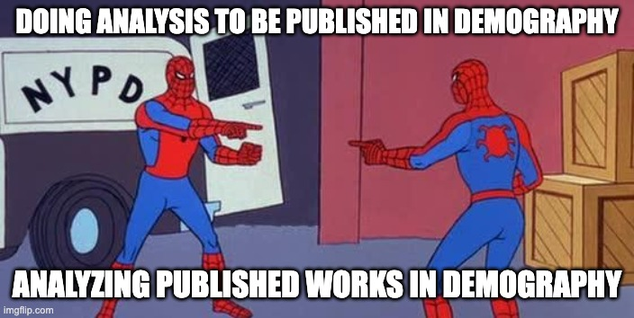

```{r setup, include=FALSE}
options(htmltools.dir.version = FALSE)
library(xaringanthemer)
# extra_css <- list(
#   ".red"   = list(color = "red"),
#   ".small" = list("font-size" = "70%"),
#   ".big" = list("font-size" = "120%"),
#   ".full-width" = list(
#     display = "flex",
#     width   = "100%",
#     flex    = "1 1 auto"
#   )
# )

style_mono_light(
  base_color = "#7D1D3F",
  header_font_google = google_font("Radio Canada"),
  text_font_google   = google_font("Montserrat", "300", "300i"),
  code_font_google   = google_font("Fira Mono")
)
```


# Overview

--

### Motivation

--

### How do we get data?

--

### A whirlwind intro to text analysis

--

### Code tutorials


---

class: center, middle, inverse

# Motivation


---

# Motivation

### What do we mean by 'non-traditional'?

--

- In short, not censuses and surveys!

--

- The nature in which data is collected and stored has changed dramatically. An increasing share of human interaction, communication and
culture is being recorded in a digital way

    + Digital records = data that is (potentially) accessible and analyzable

- 'Non-traditional' generally means not primarily collected for research purposes (but still has potential to be useful in this context)

--

- Examples

  + **Social Media data**
  + Digital trace data
  + Administrative data
  + **Corpus data** 


---

# Social media data

--

- With the rise of social media comes the rise of data

--

- Data about people

    + characteristics, movements, connections, interests, views...
--

- Potentially rich data sources for population research
--

- Strengths that traditional data sources often don't have

    + timely
    
    + large sample sizes
    
    + granular information
--

- But potential drawbacks as well 

---

# Types of social media data

--

- Population data from advertising platforms 
    
    + aggregate level population estimates by subgroup
    + useful in demographic estimation
    + e.g. [Estimating out-migration from Puerto Rico using Facebook ads data](https://onlinelibrary.wiley.com/doi/abs/10.1111/padr.12289)

--

- Individual digital trace data 

    + Individual profiles, friends and behavior
    + Text / media data, networks
    + Use to study networks, information spread, opinions, etc
    + e.g. [Assessing the Russian Internet Research Agency’s impact on the political attitudes and behaviors of American Twitter users in late 2017](https://www.pnas.org/content/pnas/117/1/243.full.pdf)
    + e.g. [Geography of Twitter networks](https://www.sciencedirect.com/science/article/pii/S0378873311000359?casa_token=_ihyPFLiN3wAAAAA:wlhmucP0-sdp_vwynl23QWEPWjNdj0w1lVAgzA8UjOQzcArTguH2BFt48MVXQc3Vkc-K3cui7Ws)    
    
--

- Survey data

    + Use social media platforms to reach and survey people
    + Timely, hard-to-reach populations, cheap?
    + e.g. [Behaviours and attitudes in response to the COVID-19 pandemic: insights from a cross-national Facebook survey](https://epjdatascience.springeropen.com/articles/10.1140/epjds/s13688-021-00270-1)


---

# Corpus data

--

- Large collections or spoken or written language

- Treating text as data; nonreactive content analysis

- Information encoded in text is a complement to more
traditional forms of data

--

- Can be text from social media data, other online sources (blogs, Wikipedia), newspapers, Hansard, bills, scholarly articles...

- Examples:

    + ['Migration Discourse in Sweden: Frames and Sentiments in Mainstream and Social Media'](https://journals.sagepub.com/doi/full/10.1177/2056305120981059)

    + ['Neutral or Framed? A Sentiment Analysis of 2019 Abortion Laws'](https://link.springer.com/article/10.1007/s13178-022-00690-2)

    + ['A mixed-methods framework for analyzing text data: Integrating computational techniques with qualitative methods in demography'](https://www.jstor.org/stable/26332229?seq=3)

---

# Example: *Demography* articles



Example research questions?

---

class: center, middle, inverse

# How do we get data?

---

# How do we get data off the web

--

### Manually?

- I guess you could copy paste info you view on a webpage
- Slow, hard, not reproducible

--

### Webscraping

- Write code that visit a webpage and extracts data
- More automated and reproducible
- Legality and ethical considerations depend on the specifics of what you're doing
- Some good tips and principles are [here](https://www.tellingstorieswithdata.com/gather-data.html#scraping).
- `rvest` is a super useful R package here

---
# How do we get data

--

### Application Programming Interfaces (APIs)

--

- A tool that makes it easier for a computer to query a website's data
- Most social media websites have APIs, that let you programmatically query and extract data
- e.g. [Facebook marketing API](https://developers.facebook.com/docs/marketing-apis/)
- [Twitter API](https://developer.twitter.com/en/docs)
- e.g. [arXiv API](https://arxiv.org/help/api/)

--

### R packages that help to query APIs

--

- Many packages exist to help R users query APIs
- We will be using `rtweet` 
- Others e.g. `rfacebookstat`, `Rlinkedin`, `scholar`...

---

class: center, middle, inverse

# A brief introduction to text analysis

---

# Text as data

--

- Inherently high dimensional. Sample of documents, $w$ words long, $p$ possible words: unique representation is $p^w$ 

--

- We need to simplify (just like any other modeling process)

--

- In general, represent raw text $\mathcal{D}$ as a numerical array $\boldsymbol{C}$

    + The elements of $\boldsymbol{C}$ are usually counts of *tokens*: words, phrases, etc.

--

- We then use  $\boldsymbol{C}$ to understand characteristics of the underlying text 

    + what words(/phrases) are common/important?
    + what is the underlying sentiment?
    + what topics are being talked/written about?
    
---

# Tokens 


- Single words, i.e. take corpus and split into single words

    + simplest, most common
    
    + problem of assuming 'bag-of-words'; independence

- *n*-grams e.g. bi-grams are two-word phrases
  
    + e.g. "cool climate wines" contains two bi-grams; "cool climate" and "climate wines"

---

# Descriptive measures


- Frequencies i.e. just counting the number of times a word/token appears in a document

- tf-idf (term-frequency - inverse document frequency)
    
    + For a word or other feature $j$ in document $i$,
    term frequency $tf_{ij}$ is the count $c_{ij}$ of occurrences of $j$ in $i$. 
    + Inverse document frequency $idf_j$ is
$$
\log(n/d_j)
$$

    where $d_j = \sum_{i} \mathbf{1}_{\left[c_{i j}>0\right]}$ and $n$ is the total number of documents. 

    + tf-idf if the product of these two quantities

---

# Sentiment analysis

--

- Outcome of interest is latent sentiment of document

--

- No estimation involved; just use a pre-specified dictionary that relates words to particular categories of sentiment

--

- Aggregate sentiment values/ratings across documents to get an idea of the relative sentiment within a corpus

--

- For example, is the underlying sentiment in new articles about immigrants associated with the political party in power?

---

# Topic models

Topic models assume that a document is a realization of a mixture of latent topics. The topics themselves are represented by a set of words that are selected from that topic. 

--

- We are trying to model a **generative process**

--

- E.g. a politician first chooses the topics they want to speak about. After choosing the topics, the politician then chooses appropriate words to use for each of those topics.

--

- E.g. a demographer decides the topics they want to write about; then chooses the appropriate words

--

- Each document as a mixture of topics, and each topic as a mixture of words.

- Statistically, topic models consider each document as having been generated by some probability distribution
over topics. Similarly, each topic is considered a probability distribution over words/terms

--

- There are many different topic models; probably the most common is Latent Dirichlet Allocation (LDA)


---

class: center, middle, inverse

# This workshop


---

# Plan for the rest of the workshop

--

- Run through two modules: Twitter data (API) and *Demography* (webscraping and text analysis)

--

- I will share my screen and go through the code in the RMarkdown files

--

- Questions / comments welcome

--

- Probably too much content??

--

- All materials available, hopefully useful as a starting point for your own learning/research: 

https://mjalexander.github.io/demopop-workshop/


---

# Let's get started!

### Contact info

<a href="mailto:monica.alexander@utoronto.ca"><i class="fa fa-paper-plane fa-fw"></i>&nbsp; monica.alexander@utoronto.ca</a><br>

<a href="monicaalexander.com"><i class="fa fa-link fa-fw"></i>&nbsp; monicaalexander.com</a><br>

<a href="http://twitter.com/monjalexander"><i class="fa fa-twitter fa-fw"></i>&nbsp; @monjalexander</a><br>

<a href="http://github.com/MJAlexander"><i class="fa fa-github fa-fw"></i>&nbsp; @MJAlexander</a><br>
